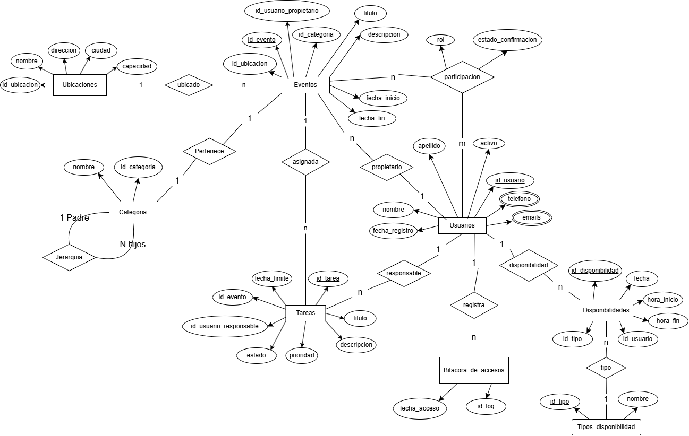

# Modelo conceptual y logico 

## Modulos que escogi:
- Gestion de ubicaciones (RF-08 a RF-10)
- Disponibilidad a Usuarios (RF-11 y RF-12)
- Tareas Asociados a Eventos (RF-15 a RF-17)

## Modelo conceptual

Adjunto la imagen del diagrama.

### Explicando brevemente las relaciones

- Ubicado: Conecta Eventos con Ubicaciones con cardinalidad 1 a N (una ubicacion aloja muchos eventos, pero cada evento tiene una unica ubicacion)
- Pertenece: Conecta a Eventos con Categoria con cardinalidad 1 a N (una categoría clasifica múltiples eventos)
- Jerarquia: Una relacion recursiva sobre la entidad Categoria (1 Padre a N Hijos) para estructurar las subcategorías.
- Asignada: Conecta Tareas con Eventos con cardinalidad 1 a N (un evento puede tener muchas tareas, cada tarea pertenece a un unico evento).
- Participacion: Es una relacion de muchos a muchos (N a M) entre Eventos y Usuarios (invitados), la cual posee los atributos descriptivos de rol y estado_confirmacion.
- Responsable: Conecta Tareas con Usuarios con cardinalidad 1 a N (un usuario puede tener muchas tareas asignadas, cada tarea tiene un único responsable)
- Registra: Concecta Usuarios con Bitacora_de_accesos con cardinalidad 1 a N (Un usuario registra varias bitacoras)
- Disponibilidad: Conecta Usuarios con Disponibilidades con cardinalidad 1 a N (un usuario declara muchas franjas de disponibilidad)
- Tipo: conecta Disponibilidades con Tipos_disponibilidad con cardinalidad N a 1 (muchas franjas pueden compartir el mismo tipo)

## Modelo logico 

- Ubicaciones (id_ubicacion[PK], nombre, direccion, ciudad, capacidad)
- Eventos (id_ubicacion[FK], id_evento[PK], id_usuario_propietario[FK], id_categoria[FK], titulo, descripcion, fecha_inicio, fecha_fin)
- Categoria (id_categoria[PK], nombre)
- Tareas (id_tarea[PK], titulo, descripcion, prioridad, estado, id_usuario_responsable[FK], id_evento[FK], fecha_limite)
- Participacion (id_usuario[PK], id_evento[PK], rol, estado_confirmacion)
- Usuarios (id_usuario[PK], nombre, apellido, fecha_registro, activo)
- Telefonos_usuarios (id_usuario [PK/FK], telefono [PK])
- Emails_usuarios (id_usuario[FK], email)
- Bitacora_de_accesos (id_log[PK], id_usuario[FK], fecha_acceso)
- Disponibilidades (id_disponibilidad[PK], fecha, hora,inicio, hora_fin, id_usuario[FK], id_tipo[FK])
- Tipos_disponibilidad (id_tipo[PK], nombre)
