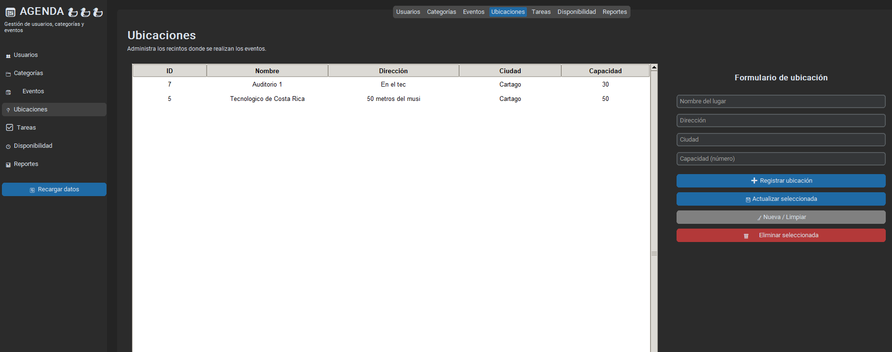
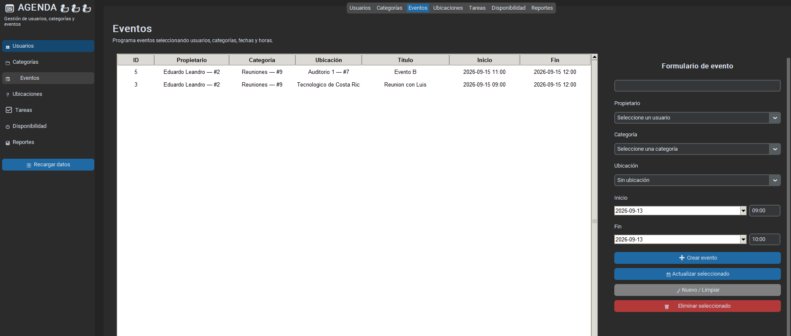
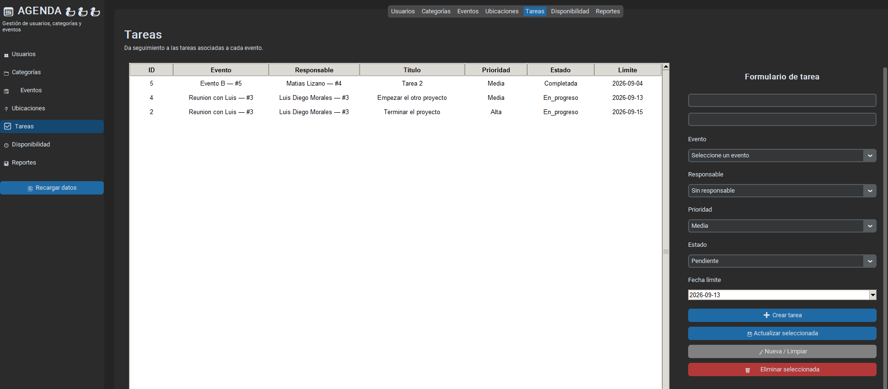
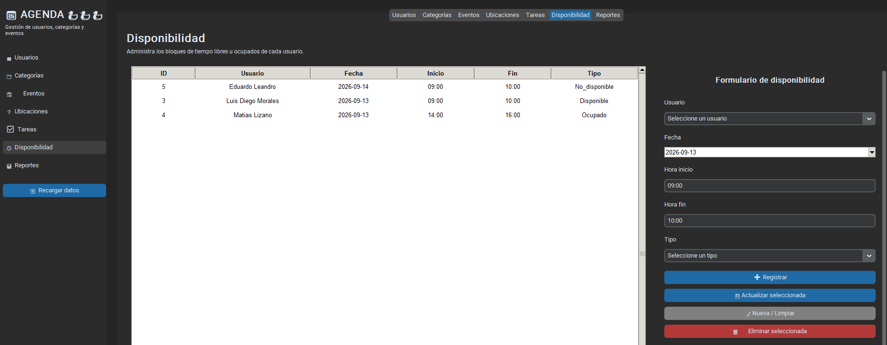
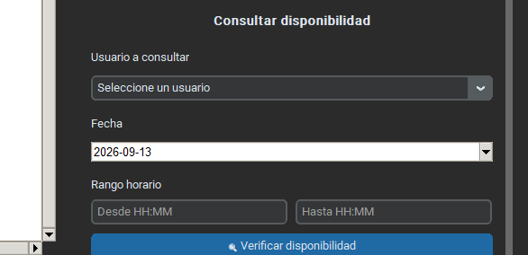
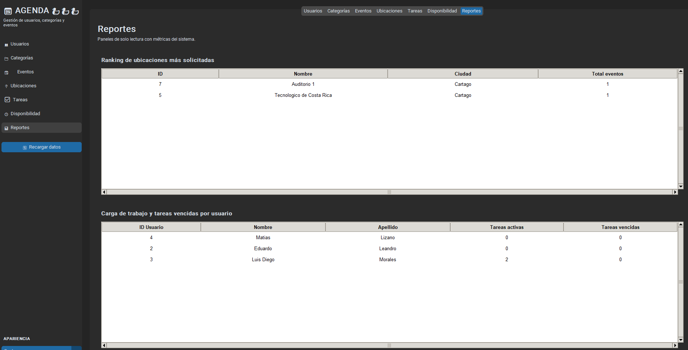

# Evidencias Visuales de la Interfaz Grafica

## 1. Gestion de Ubicaciones

Hice esta pantalla para administrar los recintos fisicos donde se realizan los eventos (RF-08).

- Tabla Central: aquí se ven todas las ubicaciones con su ID, nombre, dirección, ciudad y capacidad.
- Panel Lateral (Formulario): desde aqui puedo registrar, actualizar y eliminar ubicaciones. Le puse una validacion para que la capacidad solo acepte numeros enteros positivos antes de mandarla a la base de datos.

## 2. Eventos con Ubicacion Asociada

Amplie la pantalla de eventos para añadir la relación con Ubicaciones (RF-09).

- Agregue un selector desplegable de Ubicación en el formulario, que deje opcional, asi permito eventos virtuales sin ubicacion.
- La tabla central ahora muestra la ubicacion asignada a cada evento.
- Si intento crear dos eventos en la misma ubicacion con horarios que se cruzan, un trigger en la base de datos bloquea la operacion y la GUI me muestra el mensaje de error correspondiente.

## 3. Gestión de Tareas

Con esta pantalla puedo dar seguimiento a subtareas operativas vinculadas a un evento (RF-15).

- Tabla Central: muestra cada tarea con su evento asociado, responsable, titulo, prioridad, estado y fecha limite.
- Panel Lateral (Formulario): puse selectores desplegables para registrar la tarea con su nombre y descripcion. Ademas para vincular la tarea a un evento existente (obligatorio) y a un usuario responsable (opcional), ademas de combos de prioridad (Alta/Media/Baja) y estado (Pendiente/En_progreso/Completada/Cancelada).

## 4. Gestion de Disponibilidad

Esta pantalla la hice para que cada usuario pueda declarar bloques de tiempo libres u ocupados (RF-11).

- Tabla Central: lista las franjas de disponibilidad con usuario, fecha, horario y tipo.
- Panel Lateral (Formulario): arme un CRUD completo con selector de usuario, selector de fecha, campos de hora inicio/fin, y tipo (Disponible/Ocupado/No_disponible).

## 5. Consulta de Concurrencia

Aqui implemente RF-12: poder saber si un usuario esta libre en un rango horario especifico.

- El panel de consulta invoca la función usuario_disponible() que escribi en PostgreSQL, que cruza las franjas de disponibilidad marcadas como "Ocupado" o "No_disponible" contra el rango que le pido.
- El resultado me sale en un mensaje emergente indicando si el usuario esta disponible o no.

## 6. Panel de Reportes

En esta pestaña reuni los reportes analiticos de solo lectura del sistema (RF-10, RF-16, RF-17).

- Ranking de Ubicaciones: muestra que recintos tienen mayor volumen de eventos programados, consultando la vista vista_ranking_ubicaciones que arme.
- Carga de Trabajo por Usuario: muestra la cantidad de tareas activas y vencidas por cada usuario responsable, consultando la vista vista_tareas_pendientes_por_usuario.
- Ambos paneles se actualizan con el botón 🔄 Actualizar reportes.